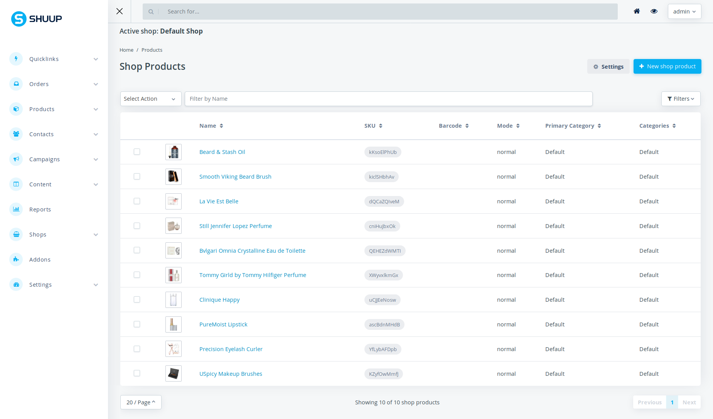
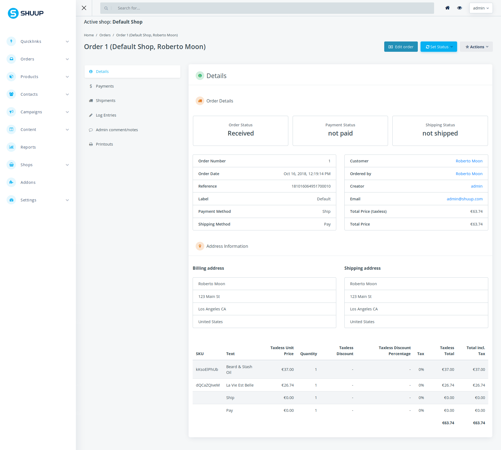

E-Commerce
=====

E-Commerce is an Open Source E-Commerce Platform based on Django and Python.

Copyright
---------

Copyright (C) 2012-2019 by Shoop Commerce Ltd.

E-Commerce is International Registered Trademark & Property of Shoop Commerce Ltd.,
Business ID: FI27184225,
Business Address: Iso-Roobertinkatu 20-22, 00120 HELSINKI, Finland.

CLA
---

Contributor License Agreement is required for any contribution to this
project.  Agreement is signed as a part of pull request process.  See
the CLA.rst file distributed with E-Commerce.

License
-------

E-Commerce is published under Open Software License version 3.0 (OSL-3.0).
See the LICENSE file distributed with E-Commerce.

Some external libraries and contributions bundled with E-Commerce may be
published under other compatible licenses. For these, please
refer to VENDOR-LICENSES.md file in the source code tree or the licenses
included within each package.

Documentation is built with `Sphinx <http://sphinx-doc.org/>`__.

Issue the following commands to build the documentation:

.. code:: sh

    pip install -r requirements-doc.txt
    cd doc && make html

To update the API documentation rst files, e.g. after adding new
modules, use command:

.. code:: sh

    ./generate_apidoc.py

Admin Preview
-------------

